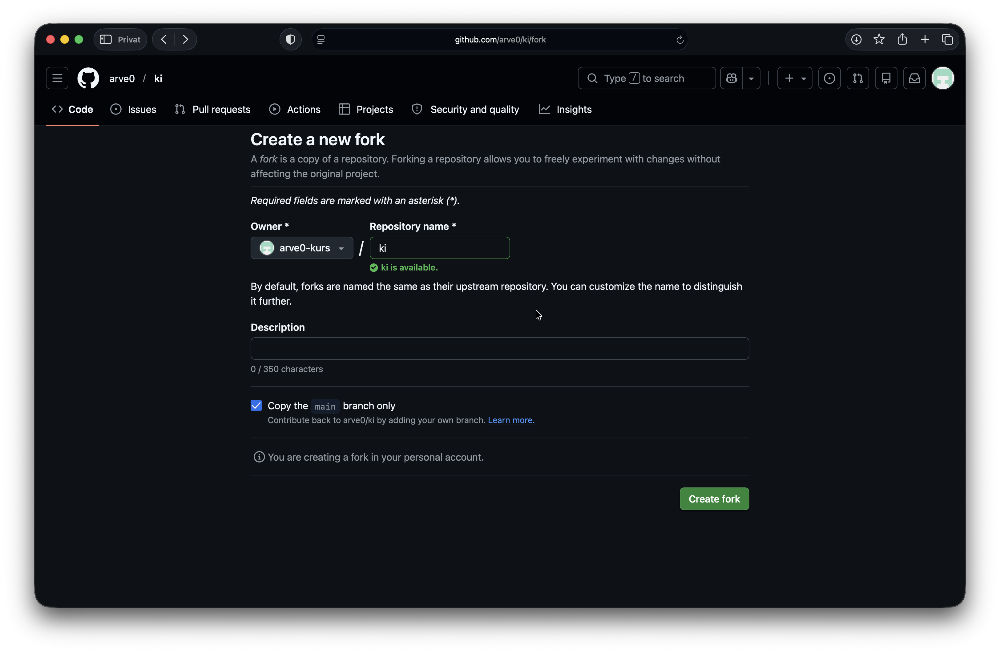
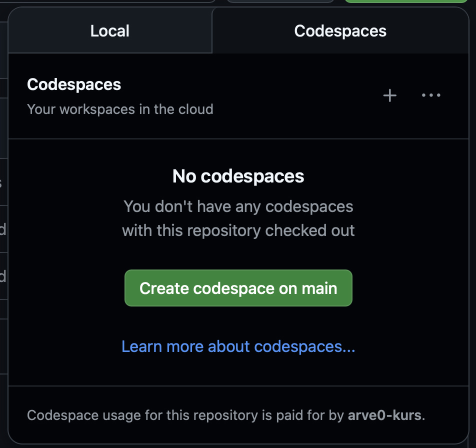
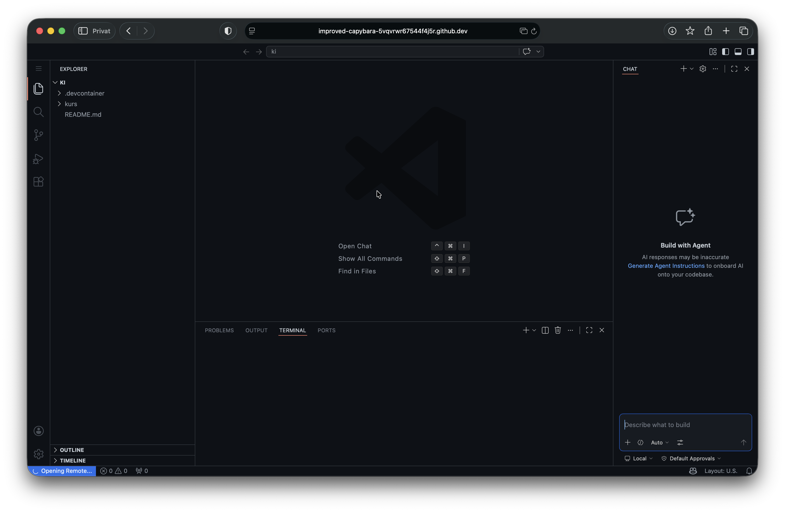

# Start

## Github Codespaces
Github Codespaces er en enkel måte å kjøre [editoren VSCode](https://code.visualstudio.com) direkte i nettleseren, slik at vi slipper å bruke tid på oppsett.

Gjennomfør disse stegene:

1. Gå til: https://github.com/arve0/ki/fork
2. Klikk på _Create fork_
   
3. Trykk på _Code_ → _Codespaces_ → _Create codespace on main_
   
4. Åpne opprettet codespace:
   

## Test at Copilot-chaten fungerer
I høyre side, skriv inn denne instruksen:

> lag et sammendrag av kurset
